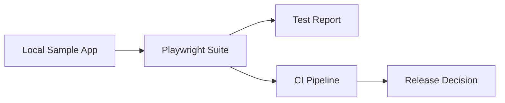

# Enterprise QA Automation Blueprint

[](https://github.com/acbharath14/enterprise-qa-automation-blueprint/actions/workflows/e2e.yml)

A Playwright + TypeScript UI test framework built around a simple idea: smoke tests should produce a release signal, not just a pass/fail log. The suite runs against a small local sample app (a release-health dashboard) and the results feed into CI quality gates.

## Architecture



## Quick Start

```bash
cd ui-tests
npm install
npx playwright install chromium
npm test
```

The sample app starts automatically through the `webServer` config in `playwright.config.ts` — no manual setup needed.

Useful scripts: `npm run test:smoke` (smoke only), `npm run test:a11y` (accessibility only), `npm run test:headed` (watch it run).

## What's Inside

- `ui-tests/pages/` — Page Object Models (all selectors live here)
- `ui-tests/fixtures/` — custom test fixtures (page ready before each test)
- `ui-tests/tests/` — smoke, dashboard, accessibility (axe-core), and API-mocked specs
- `ui-tests/sample-app/` and `server.mjs` — the local app under test, including a JSON `/api/metrics` endpoint
- `ui-tests/playwright.config.ts` — Chromium/Firefox/WebKit projects, retries on CI, trace on failure
- `.github/workflows/e2e.yml` — sharded CI, HTML + Allure reports, weekly scheduled run
- `ci/` — GitLab CI and Jenkins pipeline templates
- `docs/` — architecture notes, execution evidence, and [design decisions](docs/decisions.md)

## How CI Works

Every push/PR touching `ui-tests/` runs the suite sharded across 2 runners × 3 browsers. HTML and Allure reports are uploaded as artifacts per shard. A scheduled run every Monday keeps the badge honest.

## Roadmap

- Report publishing to GitHub Pages
- Visual regression baselines
- Data-driven suites from external fixtures

## License

MIT — see [LICENSE](LICENSE).
