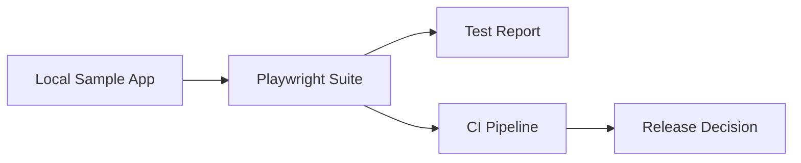

# Enterprise QA Automation Blueprint

A Playwright + TypeScript UI test framework built around a simple idea: smoke tests should produce a release signal, not just a pass/fail log. The suite runs against a small local sample app (a release-health dashboard) and the results feed into CI quality gates.

## Architecture



## Quick Start

```bash
cd ui-tests
npm install
npx playwright install chromium
npm test
```

The sample app starts automatically through the `webServer` config in `playwright.config.ts` — no manual setup needed.

## What's Inside

- `ui-tests/tests/` — smoke specs (the suite grows from here)
- `ui-tests/sample-app/` and `server.mjs` — the local app under test
- `ui-tests/playwright.config.ts` — projects, retries, trace-on-failure
- `ci/` — GitLab CI and Jenkins pipeline templates
- `docs/` — architecture notes and execution evidence

## Roadmap

- Page Object Model + fixtures layer
- Accessibility checks (axe-core) and API-mocked scenarios
- Allure reporting, sharded parallel runs, GitHub Actions

## License

MIT — see [LICENSE](LICENSE).
