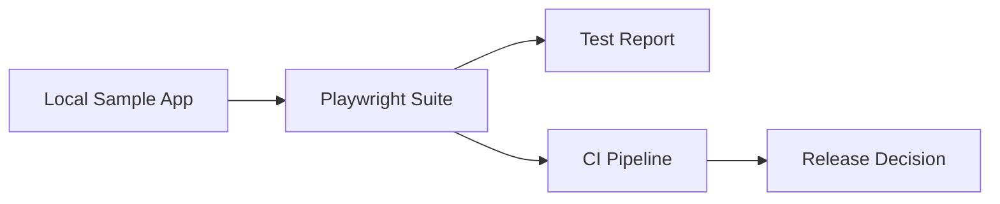

# Enterprise QA Automation Blueprint

[](https://github.com/acbharath14/enterprise-qa-automation-blueprint/actions/workflows/e2e.yml)

A Playwright + TypeScript test framework built around a simple idea: smoke tests should produce a release signal, not just a pass/fail log. The suite runs against a small local sample app (a release-health dashboard) and the results feed into CI quality gates.

**Who this is for:** testers and SDETs who want a working reference for how UI, API, accessibility, visual, performance, and security checks fit together in one suite — and a starting point they can adapt to their own application. If you are new to Playwright, start with [Getting started](#getting-started), then read [Repository tour](#repository-tour).

**Latest test reports** — published from every `main` run:
- [Playwright HTML report](https://acbharath14.github.io/enterprise-qa-automation-blueprint/) (per-shard)
- [Allure report](https://acbharath14.github.io/enterprise-qa-automation-blueprint/allure/) (trends, retries, history)

## Architecture



## Repository tour

```
.
├── playwright-suite/
│   ├── sample-app/index.html        # component gallery under test, grouped by category:
│   │                                # Release dashboard / Forms / Overlays / Advanced components
│   ├── server.mjs                   # tiny Node server: serves the app + JSON API (metrics, feedback,
│   │                                # login, upload) with security headers
│   ├── pages/                       # Page Objects: DashboardPage, GalleryPage, LoginPage —
│   │                                # every selector lives here, never in tests
│   ├── fixtures/test.ts             # custom fixtures: dashboardPage / galleryPage, already navigated
│   │                                # and ready — tests start interacting, not waiting
│   ├── tests/                       # one spec file per test type (see Test coverage below)
│   │   ├── visual.spec.ts-snapshots/ # committed screenshot baseline for visual regression
│   │   └── accessibility.spec.ts-snapshots/ # committed aria snapshot of the feedback form
│   ├── test-data/metrics.json       # data file driving the dashboard specs (edit data, not code)
│   ├── test-data/metrics-snapshot.json # committed API contract: /api/metrics must equal this
│   ├── playwright.config.ts         # projects (chromium/firefox/webkit/mobile/dark/tz/authed + auth
│   │                                # setup), retries, reporters, trace+video-on-failure, auto-started webServer
│   └── package.json                 # scripts: test, test:smoke, test:a11y, test:headed, report
├── docs/
│   ├── decisions.md                 # why the framework is shaped this way — read this for the reasoning
│   ├── ARCHITECTURE.md
│   └── EXECUTION_EVIDENCE.md
├── ci/                              # GitLab CI and Jenkins pipeline templates
└── .github/workflows/e2e.yml        # GitHub Actions: sharded runs, HTML + Allure reports, Pages deploy
```

The pattern to notice: **tests describe behavior, page objects describe the UI, fixtures remove boilerplate, data lives in files.** When you adapt this to your app, you will mostly touch `pages/`, `tests/`, and `playwright.config.ts`.

## Getting started

**Prerequisites:** Node.js 20 or newer (`node --version` to check).

```bash
# 1. Clone and install
git clone https://github.com/acbharath14/enterprise-qa-automation-blueprint.git
cd enterprise-qa-automation-blueprint/playwright-suite
npm install

# 2. Install the browsers Playwright drives (one-time download)
npx playwright install chromium
# On Linux you may need: npx playwright install --with-deps chromium (uses sudo)

# 3. Run the suite
npm test
```

The sample app starts automatically — `playwright.config.ts` launches `node server.mjs` before the tests and shuts it down after. There is nothing else to start.

After the run, open the HTML report:

```bash
npm run report
```

You should see all specs listed with pass/fail, timings, and (for failures) traces and screenshots.

## Test coverage

| Type | File | What it proves |
|---|---|---|
| Smoke | `tests/smoke.spec.ts` | Critical paths work; frozen-clock assertion on the refresh timestamp (`@smoke`) — rendered in the page's own context so it holds under any timezone |
| Dashboard | `tests/dashboard.spec.ts` | Data-driven UI assertions from `test-data/metrics.json` |
| Accessibility | `tests/accessibility.spec.ts` | axe-core scan, WCAG 2A/2AA (`@a11y` tag) + committed aria snapshot of the feedback form |
| Keyboard | `tests/keyboard.spec.ts` | Tab order, focus, Enter/Space activation — what axe-core can't check |
| API | `tests/api.spec.ts` | Contract shape, value sanity, JSON error responses, committed contract file (`test-data/metrics-snapshot.json`) |
| API mocking | `tests/api-mocked.spec.ts` | UI behavior when the backend returns 500s or slow responses |
| Integration | `tests/integration.spec.ts` | UI calls the right API and renders its response (`waitForResponse`); attaches the raw response to the report |
| Offline | `tests/offline.spec.ts` | Friendly message when the API is unreachable |
| Forms | `tests/forms.spec.ts` | Inline validation errors (soft assertions); valid submit sends the exact expected POST payload; `test.step` structure |
| Auth | `tests/auth.spec.ts` + `auth.setup.ts` | Login success/failure; setup project saves `storageState` reused by `authed.spec.ts` |
| Upload | `tests/upload.spec.ts` | File upload round-trip, server echoes the filename |
| Dialogs | `tests/dialogs.spec.ts` | Native confirm: message content, accept and dismiss paths |
| Table | `tests/table.spec.ts` | Column sorting ascending/descending |
| Search | `tests/search.spec.ts` | Autocomplete combobox: debounced results, keyboard selection, ARIA states |
| Date picker | `tests/datepicker.spec.ts` | Date input fill and schedule confirmation |
| Wizard | `tests/wizard.spec.ts` | Multi-step flow: per-step validation, back/next, review and submit (`test.step` structure) |
| Drag & drop | `tests/dragdrop.spec.ts` | Reorder the priority list with `dragTo` |
| Toast | `tests/toast.spec.ts` | Notification appears and auto-dismisses |
| Download | `tests/download.spec.ts` | CSV export: filename and file content assertions |
| iFrame | `tests/iframe.spec.ts` | Same-origin frame interaction via `frameLocator` |
| Shadow DOM | `tests/shadowdom.spec.ts` | Counter inside an open shadow root (Playwright pierces it automatically) |
| Controls | `tests/controls.spec.ts` | ARIA switch toggles `aria-checked`; range slider updates its output |
| Datetime | `tests/datetime.spec.ts` | Timestamp rendering under emulated locale/timezone (`tz` project: Pacific/Auckland, en-NZ) |
| Popup | `tests/popup.spec.ts` | Link opens a new tab (`waitForEvent('popup')`); new page is asserted and closed |
| Visual | `tests/visual.spec.ts` | Layout regression vs. committed baseline (dynamic regions masked) |
| Theme | `tests/theme.spec.ts` | Dark/light toggle flips design tokens |
| Performance | `tests/performance.spec.ts` | Load budgets, API latency budget, zero console/page errors |
| Security | `tests/security.spec.ts` | Security headers, JSON 404s, no reflection of untrusted input |

**Understanding the test types:** each spec file focuses on one quality attribute so failures point at the *kind* of problem, not just the page. `smoke.spec.ts` answers "is the app up?"; `api.spec.ts` answers "is the contract intact?"; `visual.spec.ts` answers "did the layout change?". When you add coverage for your app, follow the same rule — one file per question.

## Running tests

```bash
npm test                          # everything: 8 projects (chromium/firefox/webkit/mobile/dark/tz/authed + setup)
npm run test:smoke                 # only @smoke tagged tests — the fast release signal
npm run test:a11y                  # only @a11y tagged tests
npm run test:headed                # watch chromium run in a visible browser
npx playwright test tests/api.spec.ts                 # a single file
npx playwright test --project=firefox                 # a single project
npx playwright test --project=chromium --headed       # headed, one browser
npx playwright test --debug tests/smoke.spec.ts      # step-through debugging
```

**Regenerating the visual baseline** (after an intentional UI change):

```bash
npx playwright test visual --project=chromium --update-snapshots
```

This overwrites `tests/visual.spec.ts-snapshots/dashboard-chromium-linux.png`. Review the diff before committing — a baseline update should be a deliberate, reviewed change.

## Make it yours

Adapting this framework to your application is three steps. Here is each one with a concrete example.

**1. Point it at your app.** For a deployed environment, override the base URL — no config edit needed:

```bash
BASE_URL=https://staging.myapp.com npx playwright test
```

(When you stop using the sample app, delete the `webServer` block in `playwright.config.ts` — it only exists to serve the demo.)

**2. Add a page object.** Selectors and page actions live in `pages/`, never in test files:

```ts
// playwright-suite/pages/LoginPage.ts
import { Page, Locator } from '@playwright/test';

export class LoginPage {
  readonly username: Locator;
  readonly password: Locator;
  readonly submit: Locator;

  constructor(private page: Page) {
    this.username = page.getByLabel('Username');
    this.password = page.getByLabel('Password');
    this.submit = page.getByRole('button', { name: 'Sign in' });
  }

  async goto() {
    await this.page.goto('/login');
  }

  async login(user: string, pass: string) {
    await this.username.fill(user);
    await this.password.fill(pass);
    await this.submit.click();
  }
}
```

**3. Write a spec using the fixture.** Tests describe behavior in plain steps:

```ts
// playwright-suite/tests/login.spec.ts
import { test, expect } from '@playwright/test';
import { LoginPage } from '../pages/LoginPage';

test('user can sign in @smoke', async ({ page }) => {
  const login = new LoginPage(page);
  await login.goto();
  await login.login('tester', 's3cret');
  await expect(page.getByText('Welcome')).toBeVisible();
});
```

Tag it (`@smoke`, `@a11y`) if it belongs in a filtered run, data-drive it from `test-data/` if it has many cases, and add the reasoning to `docs/decisions.md` so the next person understands *why*.

## How CI Works

Every push/PR touching `playwright-suite/` runs the suite sharded across 2 runners × 4 projects. HTML and Allure reports are uploaded as artifacts per shard. On `main`, the merged report publishes to [GitHub Pages](https://acbharath14.github.io/enterprise-qa-automation-blueprint/). A scheduled run every Monday keeps the badge honest.

## Troubleshooting

| Symptom | Fix |
|---|---|
| `Executable doesn't exist` on first run | `npx playwright install chromium` (browsers are a separate download) |
| `EADDRINUSE` on port 4173 | another copy of the sample server is running: `lsof -ti:4173 \| xargs kill` |
| Visual test fails after you changed the UI | intentional — regenerate the baseline (see above) and commit it |
| Tests pass locally but fail in CI | check for timing assumptions and unmasked dynamic content; open the trace from the CI artifact |
| `npm test` feels slow | run a slice: `npm run test:smoke` or `--project=chromium` while developing |

## Roadmap

- Pact contract-test example for the `/api/metrics` endpoint
- Multi-environment config (dev / staging / prod via env files)
- Seedable test-data factory for larger data-driven suites

## License

MIT — see [LICENSE](LICENSE).
