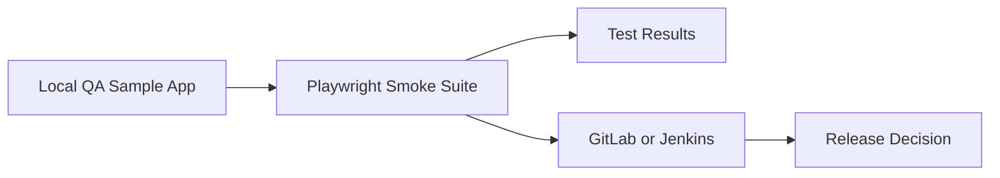

# Enterprise QA Automation Blueprint

Enterprise-grade reference framework showing layered quality engineering for UI, API, and data validation.

## Business Value
- Demonstrates how UI automation can be tied to release signals and operational health.
- Shows deterministic local execution that can be replicated in CI.
- Provides a starting point for expanding into API and data-layer validation.

## Architecture


## Day 1 Outcome
- Repository initialized with standards and structure
- Playwright UI smoke test running against a local sample app
- Interactive refresh action validated by automation
- CI templates added for GitLab and Jenkins
- First baseline commit created

## Initial Structure
- docs/ - architecture, execution plan, standards
- ui-tests/ - Playwright TypeScript smoke suite and local sample app
- ci/ - CI pipeline templates

## Quick Start
```bash
cd enterprise-qa-automation-blueprint
npm --prefix ui-tests install
npm --prefix ui-tests run test:smoke
```

## Evidence
- Smoke suite executes 2 end-to-end checks against the local app.
- Refresh interaction is validated as a user-visible state transition.
- Test output can be attached in pull requests to justify release readiness.

See: docs/evidence.md

## Demonstrable Behavior
1. Loads a locally hosted quality snapshot page.
2. Verifies key UI signals that mirror a release dashboard.
3. Confirms the refresh interaction changes the status message.

## First Commit Plan
```bash
git init
git add .
git commit -m "chore: bootstrap enterprise QA automation blueprint"
```

## Next Milestone
Implement API test layer with REST Assured and add unified report publishing.
